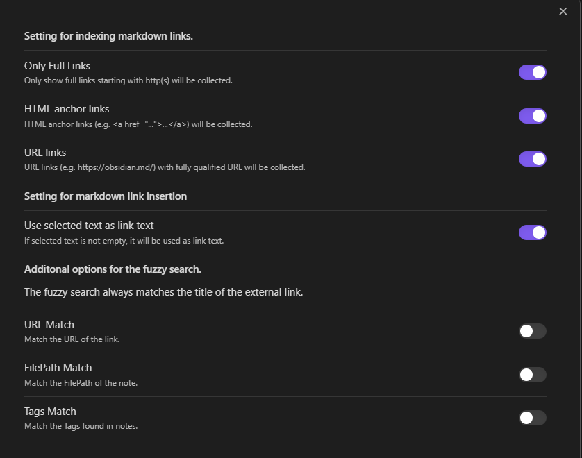

# Obsidian Plugin for finding external links

This plugin lets you search external links found in your notes. The search features with two possible actions.

## 1. Inserting an external link previously used in the notes

If you had a large number of external links used in your notes over some period of time, it is not easy to find them when you need to re-use them in your new notes. This plugin allows you to search the external links from the suggestion modal dialog and insert the selected link into your editor. You can open the modal dialog from the command palette, `External Link Helper: Open external link suggestions`.

> Refresh the page to replay

## 2. Find my favorite links using fuzzy search.

When you work on a note and need to open a website, you can open a search view, fuzzy-search the link and click to open it. You can open this external link viewer by click on the leaf ribbon icon, or choose it from the command palette, `External Link Helper: Open external link viewer`.

> Refresh the page to replay

A few more things that you can do in the external link viewer.

1. Clicking on the name of the source markdown file will open the note.
2. Clicking on the associated tags will search the external links that match the selected tag.

## 3. Settings

1. You can adjust how the plugin will find the external links in your notes from the settings.
2. You can adjust how fuzzy search will match your links.

